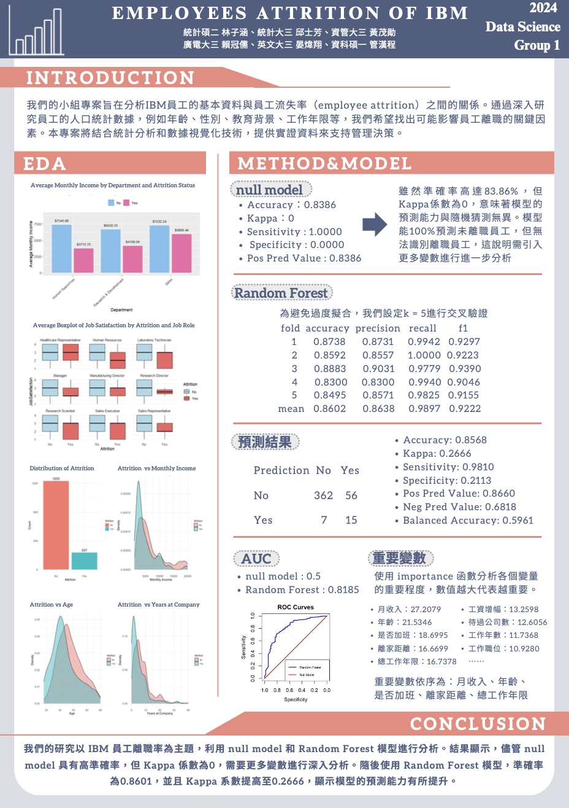

# [Group1] Employees Attrition of IBM


> Please refer to the README.md in the "results" folder to see the detail experiment results and interpretations.

The goal of this project is to analyze and predict employee attrition within the IBM dataset using various data science techniques. This involves:

1. **Exploratory Data Analysis (EDA)**: 
  Understanding the data distribution, relationships, and key patterns through statistical tests, visualizations, and summary statistics.
   - **Chi-Square Test**: Assessing the association between attrition and department.
   - **ANOVA Test**: Evaluating the effect of job role on monthly income.
   - **Distribution Analysis**: Examining the distribution of attrition concerning monthly income, age, and years at the company.
   - **Correlation Analysis**: Identifying key correlations between attrition and other variables, such as monthly income, age, and years at the company.

1. **Model Development and Evaluation**: 
  Building and evaluating predictive models to identify key factors contributing to employee attrition.
   - **Model Metrics**: Assessing model performance using metrics such as accuracy, precision, recall, F1 score, and confusion matrix statistics.
   - **Feature Importance**: Identifying the most significant features influencing attrition predictions.

1. **Visualization**: 
  Creating informative visualizations to better understand data patterns and model results.
   - **Distribution Charts**: Visualizing attrition distributions.
   - **Barcharts and Boxplots**: Depicting average monthly income and job satisfaction levels by attrition status.
   - **Heatmaps**: Visualizing correlation matrices.
   - **ROC Curve**: Comparing the performance of the predictive model against a null model.

By achieving these goals, the project aims to provide actionable insights into factors driving employee attrition, enabling the development of strategies to improve employee retention and satisfaction.

The Kaggle dataset link: [IBM Attrition](https://www.kaggle.com/code/mragpavank/ibm-hr-analytics-employee-attrition-performance/notebook)

## Contributors
|組員|系級|學號|工作分配|
|-|-|-|-|
|黃茂勛|資管大三|110306019|程式開發(EDA, model)、Repository維護|
|賴冠儒|廣電大三|110405026|程式開發(EDA)| 
|林子涵|統計碩二|112354015|程式開發(model)、每周訂討論室|
|晏煒翔|英文大三|110501035|程式開發(EDA)|
|管漢程|資科碩一|112753134|程式開發(model)|
|邱士芳|統計大三|110304039|程式開發(model)、海報製作

## Quick start
The random forest command (no smote and grid search)
```R
Rscript code/Supervised_Model.R
```
<!-- Please provide an example command or a few commands to reproduce your analysis, such as the following R script:
```R
Rscript code/your_script.R --input data/training --output results/performance.tsv
``` -->

## Folder organization and its related description
idea by Noble WS (2009) [A Quick Guide to Organizing Computational Biology Projects.](https://journals.plos.org/ploscompbiol/article?id=10.1371/journal.pcbi.1000424) PLoS Comput Biol 5(7): e1000424.

### docs
* Your presentation, 1122_DS-FP_groupID.ppt/pptx/pdf (i.e.,1122_DS-FP_group1.ppt), by **06.13**
* Any related document for the project, i.e.,
  * discussion log
  * software user guide

### Project structure
```
finalproject-group1
├─ .DS_Store
├─ .Rhistory
├─ README.md
├─ code
│  ├─ .DS_Store
│  ├─ EDA
│  │  ├─ .DS_Store
│  │  ├─ EDA_ANOVA.R
│  │  ├─ EDA_ANOVA_2.R
│  │  ├─ EDA_chi_square_test.R
│  │  ├─ EDA_correlation.R
│  │  ├─ EDA_distribution.R
│  │  └─ EDA_ttest.R
│  ├─ GridSearch_SMOTE.R
│  └─ Supervised_Model.R
├─ data
│  ├─ .DS_Store
│  └─ WA_Fn-UseC_-HR-Employee-Attrition.csv
├─ docs
│  ├─ .DS_Store
│  ├─ poster_1122_DS-FP_group1.pdf
│  └─ slides_1122_DS-FP_group1.pdf
├─ results
│  ├─ .DS_Store
│  ├─ EDA_results
│  │  ├─ .DS_Store
│  │  ├─ README.md
│  │  ├─ cor_barchart.png
│  │  ├─ cor_boxplot.png
│  │  ├─ cor_heatmap.png
│  │  └─ distribution.png
│  └─ model
│     ├─ .DS_Store
│     ├─ README.md
│     ├─ after_smote_grid_search.png
│     ├─ feature_importance.jpg
│     └─ roc.jpg
└─ teaser.png
```

<!-- ### data
* Input
  * Source
  * Format
  * Size

### code
* Analysis steps
* Which method or package do you use?
* How do you perform training and evaluation?
  * Cross-validation, or extra separated data
* What is a null model for comparison?

### results
* What is your performance?
* Is the improvement significant? -->

<!-- ## References
* Packages you use
* Related publications -->