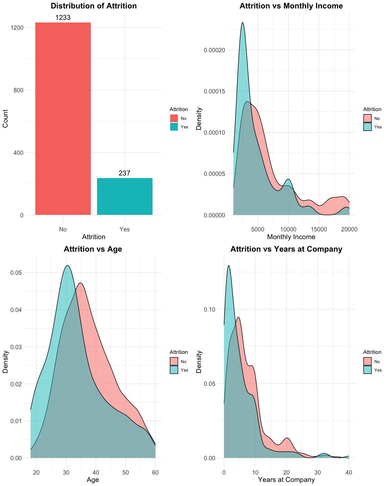
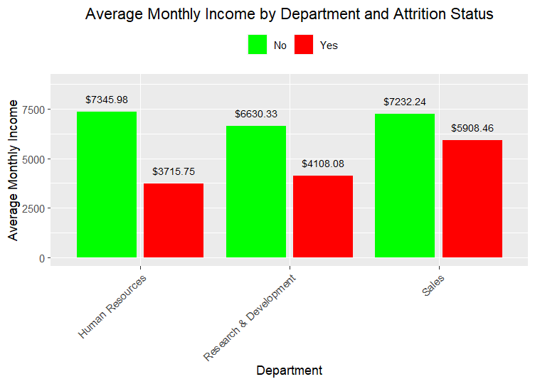
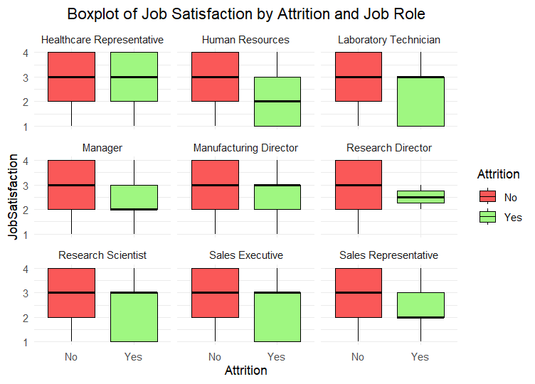
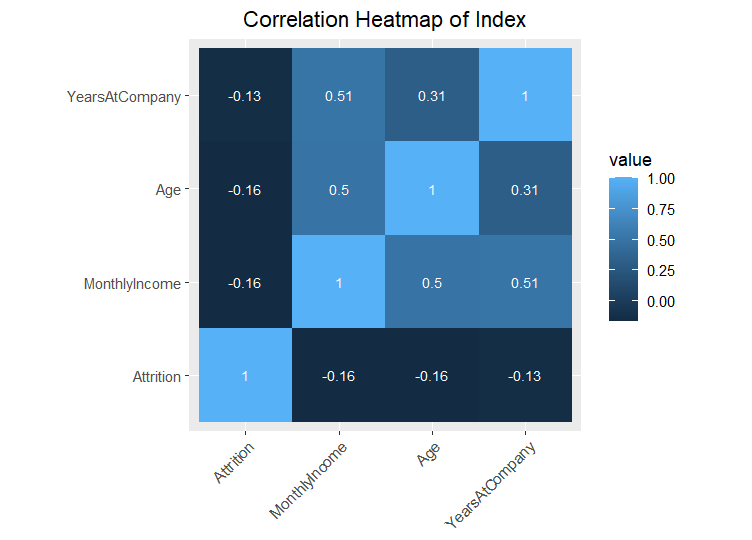

# Statistic Testing
## T-Test for Independent Samples: Monthly Income and Attrition
**Data**: `attrition_yes_income` and `attrition_no_income`
- **t-statistic**: -7.4826
- **Degrees of freedom**: 412.74
- **p-value**: $4.434 \times 10^{-13}$
- **Alternative hypothesis**: True difference in means is not equal to 0
- **95% confidence interval**: -2583.050 to -1508.244
- **Sample estimates**:
  - Mean of `attrition_yes_income`: 4787.093
  - Mean of `attrition_no_income`: 6832.740

**Interpretation**: The T-Test for independent samples indicates that there is a significant difference in the mean monthly income between employees who left the company (`Attrition = 'Yes'`) and those who stayed (`Attrition = 'No'`). The p-value ($4.434 \times 10^{-13}$) is significantly less than 0.05, leading us to reject the null hypothesis that there is no difference in means. Specifically, employees who left the company have a lower mean monthly income (4787.093) compared to those who stayed (6832.740). The 95% confidence interval for the difference in means ranges from -2583.050 to -1508.244, indicating that the true difference in means is expected to lie within this range.

## Chi-Square Test on Attrition and Department
**Results**:
- **X-squared**: 10.796
- **Degrees of freedom (df)**: 2
- **p-value**: 0.004526

**Statistically Significant Association**: 
- Since the p-value (0.004526) is less than 0.05, we reject the null hypothesis.
- This means there is a statistically significant association between attrition and department.

**Interpretation of Association**: 
- The association suggests that the attrition rates vary significantly across different departments.

## ANOVA Test for the Effect of Job Role on Monthly Income
**Results**:
| Source    | Df   | Sum Sq      | Mean Sq     | F value | Pr(>F)     |
|-----------|------|-------------|-------------|---------|------------|
| **JobRole**   | 8    | 2.657e+10   | 3.321e+09   | 810.2   | <2e-16 *** |
| **Residuals** | 1461 | 5.989e+09   | 4.099e+06   |         |            |

**Interpretation**: The ANOVA test indicates that there is a statistically significant effect of job role on monthly income. The very low p-value (<2e-16) suggests that the difference in mean monthly income across different job roles is highly significant. Therefore, we reject the null hypothesis, which states that the means of monthly income are the same across different job roles. There is strong evidence that the average monthly income varies by job role. The F value of 810.2 further supports the significance of this effect.

## ANOVA for Job Satisfaction across Departments
**Analysis of Variance (ANOVA)**
| Source         | Df | Sum Sq | Mean Sq | F value | Pr(>F) |
|----------------|----|--------|---------|---------|--------|
| **Department** | 2  | 1.2    | 0.6111  | 0.502   | 0.605  |
| **Residuals**  | 1467 | 1785.5 | 1.2171  |         |        |

**Interpretation**: The ANOVA test indicates that there is no significant difference in the mean job satisfaction scores across different departments. The p-value (0.605) is greater than 0.05, leading us to fail to reject the null hypothesis that the mean job satisfaction scores are equal across the departments. This suggests that job satisfaction is consistent regardless of the department. The F value is 0.502, and the degrees of freedom (Df) for the departments are 2, with the residual degrees of freedom being 1467.

# Distribution
This set of charts provides an overview of attrition distribution and its relationship with monthly income, age, and years at the company:

* Distribution of Attrition: Most employees did not leave the company, with a significantly higher count of 'No' compared to 'Yes'.
* Attrition vs. Monthly Income: Employees who left ('Yes') generally had lower monthly incomes.
* Attrition vs. Age: Younger employees (around age 30) showed higher attrition rates.
* Attrition vs. Years at Company: Employees with fewer years at the company showed higher attrition rates, indicating newer employees are more likely to leave.

# Correlation
# Barchart
This bar chart shows the average monthly income of employees in different departments, categorized by their attrition status (Yes or No). Key observations:

* Employees who stayed (No) generally have higher average monthly incomes than those who left (Yes) across all departments.
* The Human Resources department shows a significant income disparity between employees who stayed and those who left.

## Boxplot
This set of boxplots shows job satisfaction levels categorized by job role and attrition status:

* Job satisfaction levels vary across different job roles.
* In some roles, such as Human Resources and Laboratory Technician, employees who left (Yes) generally had lower job satisfaction compared to those who stayed (No).

## Heatmap
This heatmap visualizes the correlation between different indices:

* Attrition has a negative correlation with Monthly Income, Age, and Years at Company, suggesting that higher income, older age, and longer tenure are associated with lower attrition rates.
* Monthly Income is positively correlated with Age and Years at Company, indicating that more experienced and older employees tend to earn more.

