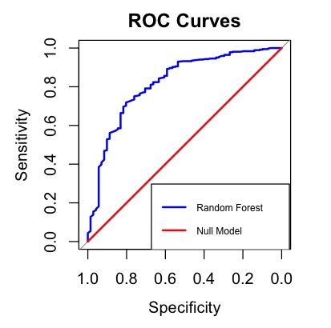
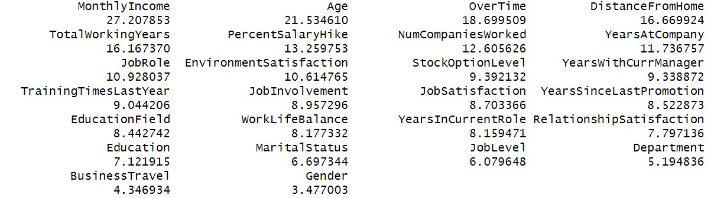

# Model Evaluation
## Interpretation
The model evaluation results indicate the following:

* The model performs consistently across different folds with high recall and F1 scores, indicating it effectively identifies relevant instances.
* The average accuracy across validation folds is around 86%, with precision and recall values being relatively high, suggesting a balanced performance.
* The test set results show an accuracy of 85.68%, with a very high sensitivity (98.10%) but low specificity (21.13%). This indicates the model is very good at identifying true positives but struggles with true negatives.
* The null model results provide a baseline with an accuracy of 83.86%, but it achieves this by predicting all instances as the majority class (No), hence having zero specificity and balanced accuracy.

## Validation Results by Fold

| Fold | Accuracy | Precision | Recall  | F1 Score |
|------|----------|-----------|---------|----------|
| 1    | 0.8738   | 0.8731    | 0.9942  | 0.9297   |
| 2    | 0.8592   | 0.8557    | 1.0000  | 0.9223   |
| 3    | 0.8883   | 0.9031    | 0.9779  | 0.9390   |
| 4    | 0.8301   | 0.8300    | 0.9940  | 0.9046   |
| 5    | 0.8495   | 0.8571    | 0.9825  | 0.9155   |

## Mean Validation Metrics

| Metric    | Value   |
|-----------|---------|
| Accuracy  | 0.8602  |
| Precision | 0.8638  |
| Recall    | 0.9897  |
| F1 Score  | 0.9222  |

## Test Confusion Matrix and Statistics

|               |         |
|---------------|---------|
| **Accuracy**  | 0.8568  |
| **95% CI**    | (0.8206, 0.8882) |
| **No Information Rate** | 0.8386 |
| **P-Value [Acc > NIR]** | 0.1657 |
| **Kappa**     | 0.2666  |
| **Mcnemar's Test P-Value** | 1.472e-09 |
| **Sensitivity** | 0.9810 |
| **Specificity** | 0.2113 |
| **Pos Pred Value** | 0.8660 |
| **Neg Pred Value** | 0.6818 |
| **Prevalence** | 0.8386 |
| **Detection Rate** | 0.8227 |
| **Detection Prevalence** | 0.9500 |
| **Balanced Accuracy** | 0.5961 |
| **Positive Class** | No |

## Null Model Confusion Matrix and Statistics

|               |         |
|---------------|---------|
| **Accuracy**  | 0.8386  |
| **95% CI**    | (0.8009, 0.8718) |
| **No Information Rate** | 0.8386 |
| **P-Value [Acc > NIR]** | 0.5316 |
| **Kappa**     | 0       |
| **Mcnemar's Test P-Value** | <2e-16 |
| **Sensitivity** | 1.0000 |
| **Specificity** | 0.0000 |
| **Pos Pred Value** | 0.8386 |
| **Neg Pred Value** | NaN    |
| **Prevalence** | 0.8386 |
| **Detection Rate** | 0.8386 |
| **Detection Prevalence** | 1.0000 |
| **Balanced Accuracy** | 0.5000 |
| **Positive Class** | No |

## ROC Curve and AUC Score
Random Forest(ours): Area under the curve: 0.8185
Null Model(the majority class): Area under the curve: 0.5

# Feature Importance

## Interpretation
* MonthlyIncome (27.21): This feature has the highest importance, suggesting that it plays a crucial role in the model's predictions.
* Age (21.53): Age is also highly important, indicating that it significantly impacts the model's outcomes.
* OverTime (18.70): This feature is another key factor, implying that whether an employee works overtime is important for the model.
* DistanceFromHome (16.67): The distance an employee lives from their workplace is also a significant feature.
* TotalWorkingYears (16.17): The total number of working years is crucial, showing its importance in the model.
* PercentSalaryHike (13.26): The percentage salary hike is also an important factor, affecting the model's predictions.
* NumCompaniesWorked (12.61): The number of companies an employee has worked for is significant.

The remaining features have lower importance values but still contribute to the model. These features include JobRole, EnvironmentSatisfaction, JobInvolvement, WorkLifeBalance, MaritalStatus, and others, with their respective importance values.

In summary, income, age, overtime work, distance from home, total working years, salary hike, and the number of companies worked for are the most influential features in this model.